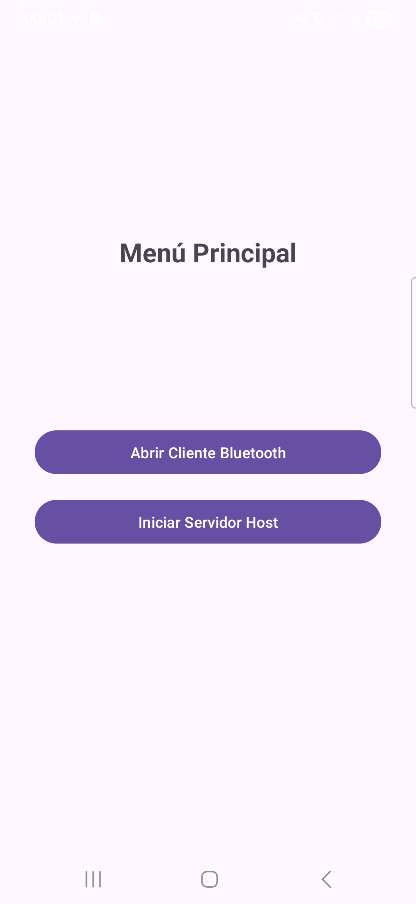
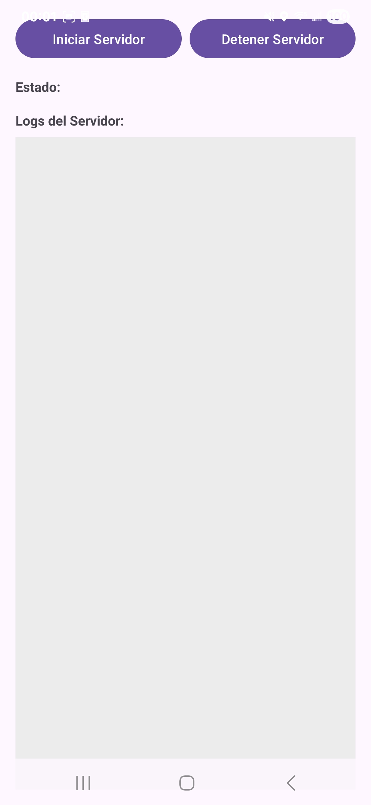
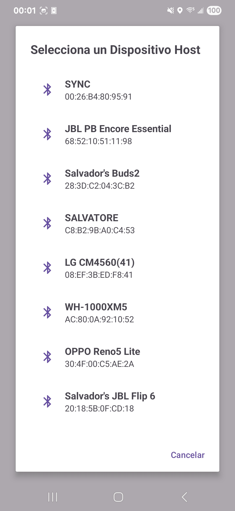
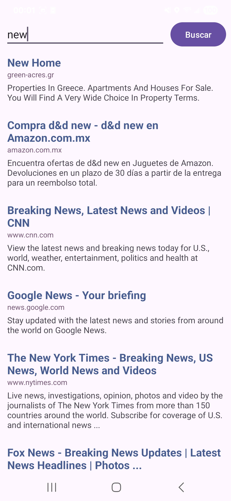

# Bluetooth Web Browser 🌐➡️️🔷

Una aplicación Android experimental que convierte un dispositivo con conexión a internet en un "hotspot" de datos para otro dispositivo sin internet, utilizando únicamente Bluetooth para la comunicación.

---

###  Demo de la Aplicación

Aquí puedes ver una demostración rápida de cómo funciona la aplicación, mostrando la conexión y una búsqueda exitosa.

---

###  Screenshots de las Activities

### 📸 Screenshots

<table>
  <tr>
    <td align="center"><strong>1. Menú Principal</strong></td>
    <td align="center"><strong>2. Pantalla del Host</strong></td>
    <td align="center"><strong>3. Cliente (Listo para Conectar)</strong></td>
  </tr>
  <tr>
    <td></td>
    <td></td>
    <td></td>
  </tr>
  
  <tr>
    <td align="center"><strong>4. Diálogo de Dispositivos</strong></td>
    <td align="center"><strong>5. Cliente (Conectado)</strong></td>
  </tr>
  <tr>
    <td></td>
    <td></td>

  </tr>

</table>

---

### 🚀 Acerca del Proyecto

Este proyecto nació como una solución al desafío de proveer acceso a información web a un dispositivo que carece de conexión a internet (Wi-Fi o datos móviles), utilizando únicamente una conexión Bluetooth con un dispositivo anfitrión que sí tiene acceso.

La aplicación se divide en dos roles principales:

* **📱 Host (Anfitrión):** Actúa como un servidor/gateway. Escucha peticiones de búsqueda vía Bluetooth, las procesa accediendo a internet, y devuelve los resultados parseados.
* **📲 Cliente:** Actúa como un "navegador" liviano. Envía términos de búsqueda al Host y muestra los resultados recibidos, todo sin tener conexión directa a internet.

---

### ✨ Características Principales

* **Comunicación 100% por Bluetooth:** No se requiere Wi-Fi ni datos en el dispositivo cliente.
* **Arquitectura Cliente-Servidor:** Diseño robusto que separa claramente las responsabilidades.
* **Servicio en Primer Plano:** El Host se ejecuta como un `ForegroundService` para garantizar estabilidad y que no sea terminado por el sistema operativo.
* **Web Scraping en Tiempo Real:** El Host obtiene los datos directamente del motor de búsqueda DuckDuckGo.
* **Protocolo de Comunicación Personalizado:** Se implementó un protocolo simple (tamaño + datos) para asegurar la transmisión completa de datos a través del stream de Bluetooth.
* **Mecanismo de Keep-Alive:** Un sistema de "ping-pong" para mantener la conexión Bluetooth activa y prevenir desconexiones por inactividad.

---

### 🛠️ Tecnologías Utilizadas

Este proyecto fue construido utilizando tecnologías y arquitecturas modernas de Android:

* **Lenguaje:** [Kotlin](https://kotlinlang.org/)
* **Arquitectura:** MVVM (Model-View-ViewModel)
* **UI:** Android Views con XML y ViewBinding
* **Asincronía:** Coroutines de Kotlin para manejar operaciones de red y Bluetooth.
* **Networking:** [Retrofit](https://square.github.io/retrofit/) para realizar las peticiones HTTP.
* **HTML Parsing:** [Jsoup](https://jsoup.org/) para extraer la información del HTML recibido.
* **Serialización:** [Gson](https://github.com/google/gson) para convertir objetos a formato JSON.
* **Componentes de Jetpack:** ViewModel, LiveData/StateFlow, Activity, Fragment, RecyclerView.

---

### 🏗️ Arquitectura

La aplicación sigue un modelo Cliente-Servidor sobre un socket Bluetooth RFCOMM.

1.  **Host:**
    * Un `ForegroundService` mantiene un `BluetoothServerSocket` escuchando conexiones.
    * Al recibir una conexión, un `SearchProcessor` realiza una petición web con Retrofit.
    * El HTML resultante es parseado con Jsoup.
    * Los datos limpios se serializan a JSON con Gson y se envían de vuelta por el `BluetoothSocket`.

2.  **Cliente:**
    * La `ClientActivity` permite al usuario seleccionar un dispositivo Host emparejado.
    * Un `BluetoothClientCommunicationManager` gestiona la conexión y la comunicación.
    * Las búsquedas se envían como strings.
    * Un bucle de escucha lee el tamaño del mensaje y luego el payload JSON, evitando errores por datos incompletos.
    * El JSON se deserializa con Gson y se muestra en un `RecyclerView`.

---

### ⚙️ Cómo Empezar

Para compilar y ejecutar este proyecto localmente, necesitarás:

1.  Android Studio (se recomienda la última versión).
2.  Dos dispositivos Android físicos para probar la conexión Bluetooth.

Pasos:
1.  Clona el repositorio: `git clone https://github.com/Salvatorecoscab/AndroidBluetoothHotspot`
2.  Abre el proyecto en Android Studio.
3.  Compila y ejecuta la aplicación en ambos dispositivos.

---

### 🚀 Uso de la Aplicación

1.  **Emparejar Dispositivos:** En los Ajustes de Android, empareja los dos teléfonos vía Bluetooth.
2.  **Iniciar el Host:** En el teléfono con internet, abre la app, selecciona "Iniciar Servidor Host". Una notificación persistente indicará que está funcionando.
3.  **Conectar el Cliente:** En el teléfono sin internet, abre la app, selecciona "Abrir Cliente Bluetooth".
4.  Presiona el botón "Conectar con Host" y selecciona el dispositivo Host de la lista de dispositivos emparejados.
5.  **¡Buscar!** Una vez conectado, la barra de búsqueda aparecerá. Escribe tu consulta y presiona "Buscar" para ver los resultados.

---

### 📬 Contacto

Link del Proyecto: [https://github.com/Salvatorecoscab/AndroidBluetoothHotspot](https://github.com/Salvatorecoscab/AndroidBluetoothHotspot)